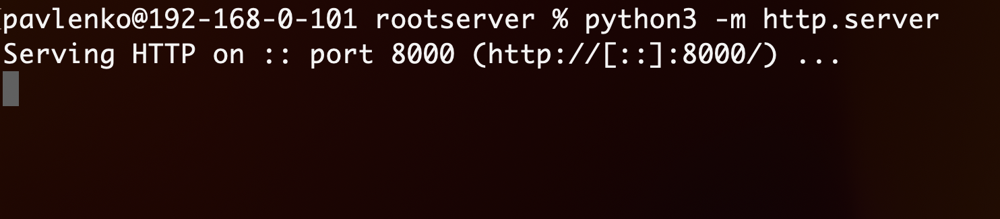
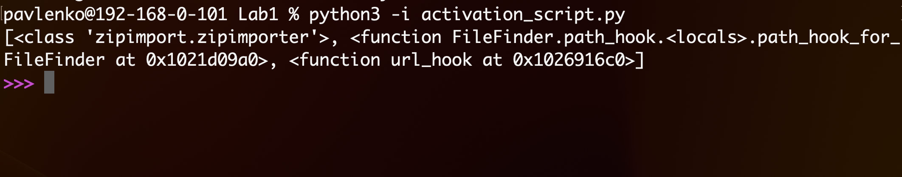
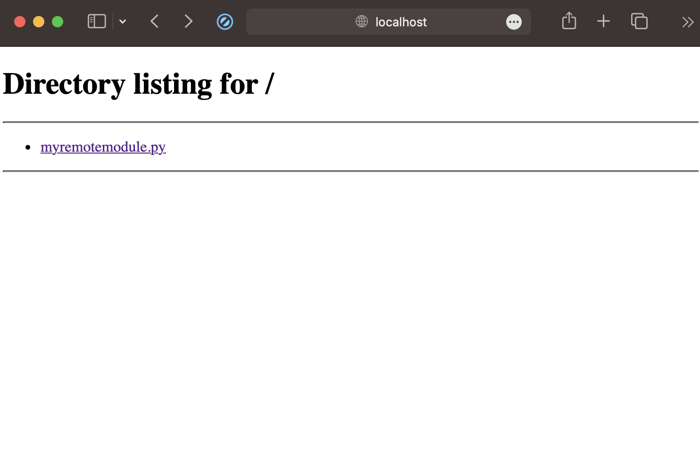
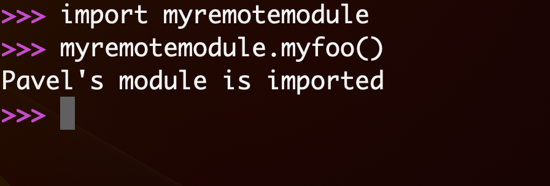

# Лабораторная работа №1 Реализация удаленного импорта

### Демонастрация работы

**1. Запуск сервера**

**2. Запуск файла activation_script.py**

**3. Добавление пути, где располагается модуль**

**4. Импорт модуля**
