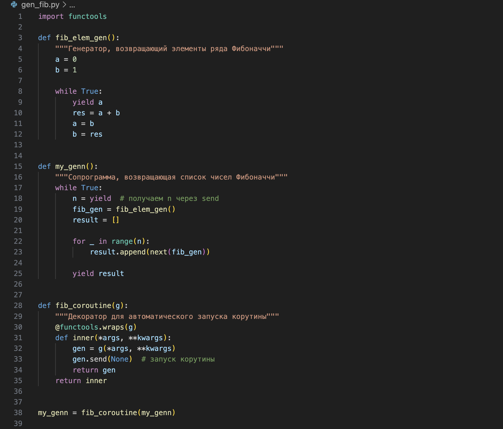
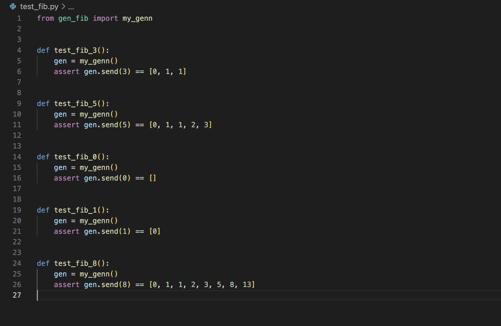
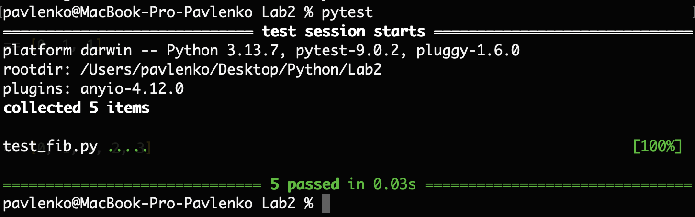
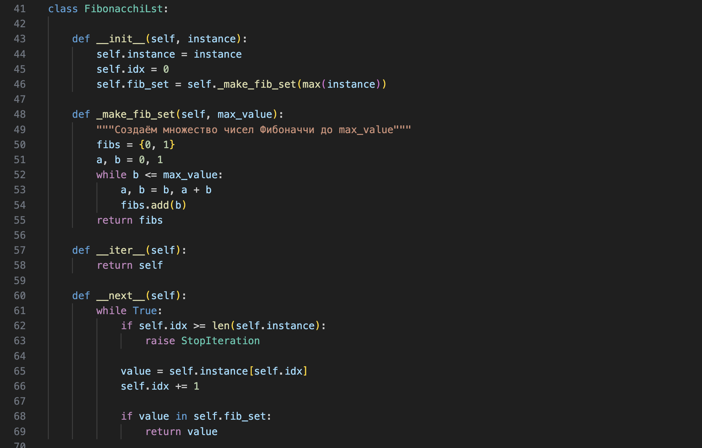

# Лабораторная работа 2. Ряд Фибоначчи с помощью итераторов
## Задание 1
На основе приложенного кода в файле gen_fib.py разработать сопрограмму (корутину), реализующую возвращение списка элементов ряда Фибоначчи.

**Код gen_fib.py**

**Результат выполнения программы**

**Тесты**

**Результаты тестов**

## Задание 2
Дополните код классом FibonacchiLst (пример такого класса представлен в even_numbers_iterator.py), который бы позволял перебирать элементы из ряда Фибоначчи по данному ей списку. Итератор должен вернуть очередное значение, которое принадлежит ряду Фибоначчи, из данного ей списка. Например: для lst = [0, 1, 2, 3, 4, 5, 6, 7, 8, 9, 1], FibonacchiLst должен вернуть [0, 1, 2, 3, 5, 8, 1]

**Код**

**Результат выполнения программы**
