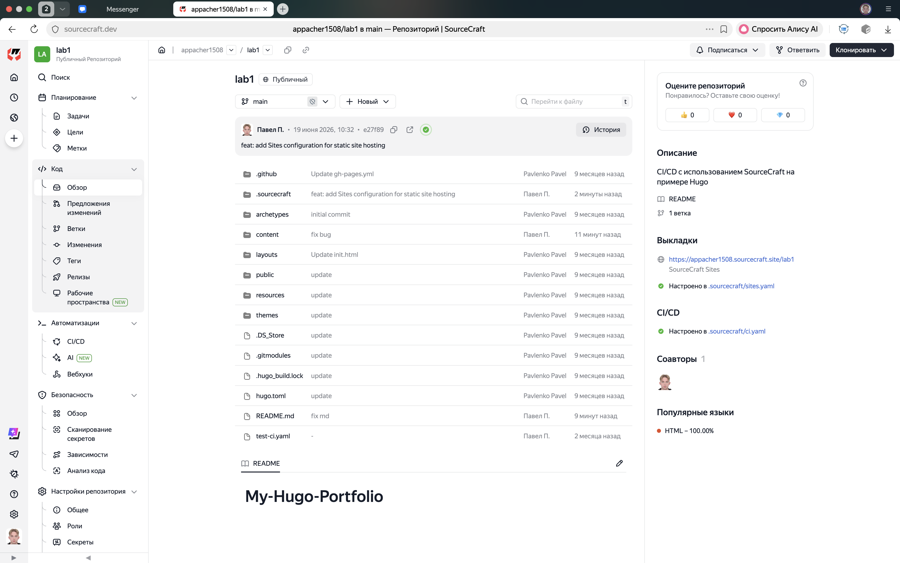
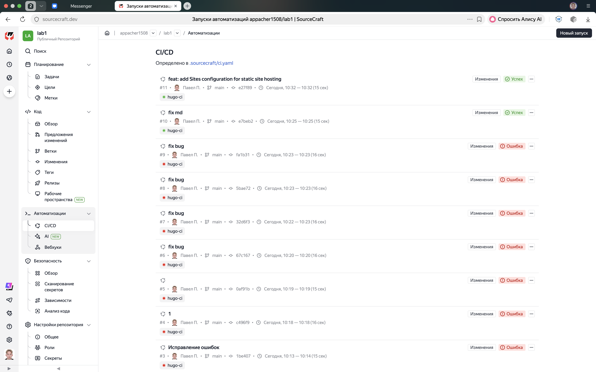
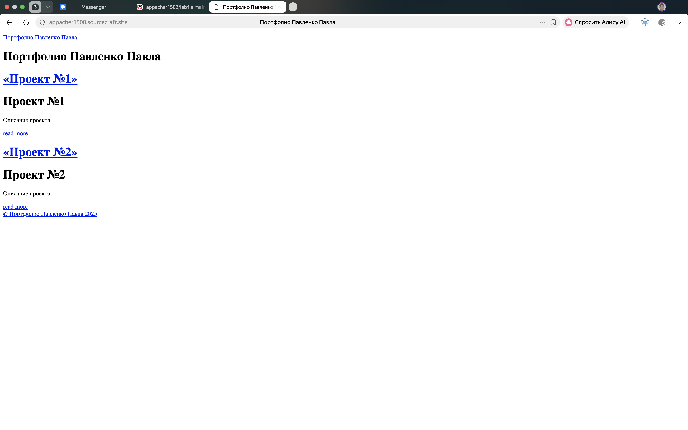

# Лабораторная работа: CI/CD для Hugo на платформе SourceCraft

## 1. Подготовка платформы

Зарегистрировался на [sourcecraft.dev](https://sourcecraft.dev/) через учётную запись Yandex,
создал публичную организацию и публичный репозиторий.

Склонировал репозиторий и загрузил основу статического сайта на Hugo.


## 2. CI/CD пайплайн

Реализован пайплайн `hugo-ci` в файле `ci.yaml` со следующими задачами:

- **lint-markdown** — проверка синтаксиса Markdown с помощью `markdownlint-cli`
- **build-hugo** — сборка статического сайта командой `hugo --minify`

### ci.yaml

```yaml
on:
  pull_request:
    - workflows: [hugo-ci]
      filter:
        source_branches: ["**"]
        target_branches: ["main"]
  push:
    - workflows: [hugo-ci]
      filter:
        branches: ["main"]

workflows:
  hugo-ci:
    tasks:
      - name: lint-markdown
        cubes:
          - name: run-markdownlint
            image: node:18-alpine
            script:
              - npm install -g markdownlint-cli
              - markdownlint "**/*.md" --ignore node_modules --ignore public

      - name: build-hugo
        cubes:
          - name: build-site
            image: alpine:latest
            script:
              - apk add --no-cache hugo
              - hugo --minify
            artifacts:
              paths:
                - public/
```

## 3. Результат

Пайплайн успешно выполняется при каждом пуше в ветку `main` и при создании
pull request. Шаг lint-markdown проверяет все MD-файлы на соответствие стандартам,
шаг build-hugo собирает готовый сайт в папку `public/`.



